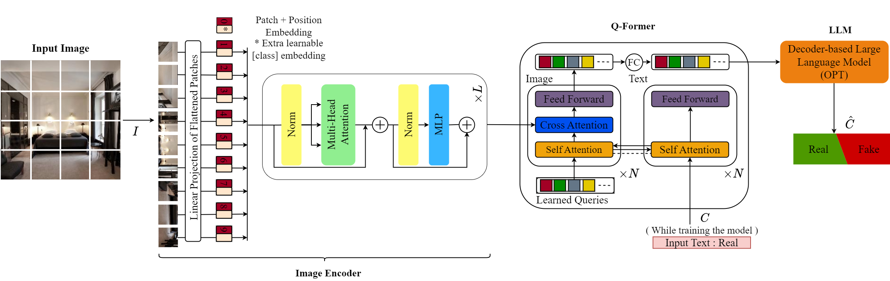
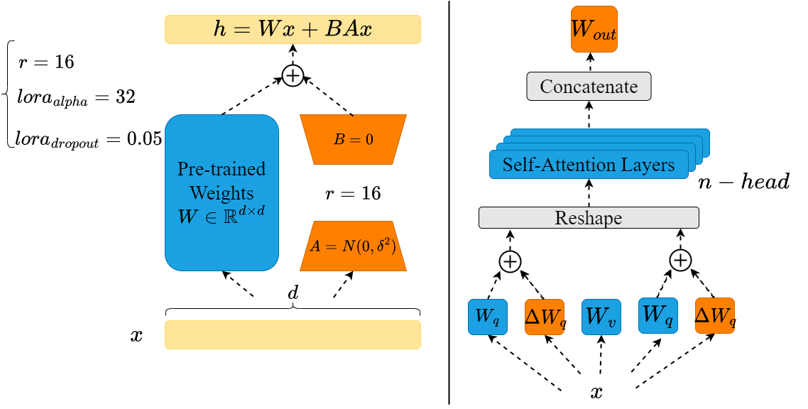

# Harnessing the Power of Large Vision Language Models for Synthetic Image Detection

This repository is an official implementation of the ICASSP 2024 paper "[*Harnessing the Power of Large Vision Language Models for Synthetic Image Detection*](https://arxiv.org/pdf/2404.02726)".

☀️ If you find this work useful for your research, please kindly star our repo and cite our paper! ☀️



## Low Rank Adaptation



## Requirements
``` python
pip install -r requirements.txt
```

## SOTA Detection Methods

We use the codes of detection methods provided in the corresponding paper. 

- [AntifakePrompt](https://github.com/nctu-eva-lab/antifakeprompt)
- [DE-FAKE](https://github.com/zeyangsha/De-Fake)
- [UniversalFakeDetect](https://github.com/Yuheng-Li/UniversalFakeDetect)
- [CNNDetection](https://github.com/PeterWang512/CNNDetection)
- [DIRE](https://github.com/ZhendongWang6/DIRE)
- [FusingGlobalandLocal](https://github.com/littlejuyan/FusingGlobalandLocal)
- [ClipBased-SyntheticImageDetection](https://grip-unina.github.io/ClipBased-SyntheticImageDetection/)
- [DMimageDetection](https://github.com/grip-unina/DMimageDetection)
- [Diffusers](https://github.com/davide-coccomini/Detecting-Images-Generated-by-Diffusers)

## Training (Optional)
This step can be skipped, and you can directly test the model in the following section with a pre-trained model.

To train your own model:
```python
python blip2_detect.py --dataset ./data/train.csv --epochs 20 --lr 5e-5 
```

### GNN-CoT Extension

This fork adds an optional research branch for explainable synthetic image detection:

- A visual-text heterogeneous graph head builds spatial patch nodes, frequency patch nodes, and text prompt nodes, then performs topology-aware message passing before fake/real classification.
- A structured CoT target changes the answer from a single word to four forensic steps: quick intuition, salient evidence, deep reasoning, and final conclusion.
- An RLHF-style differentiable reward can use the final answer, report structure, graph-label alignment, and an optional human feedback score column.

Example training command:

```python
python blip2_detect_aligned.py \
    --dataset ./data/Train_CSV_Balanced/train_LDM_balanced.csv \
    --base_model ./blip2-opt-2.7b \
    --epochs 20 \
    --batch_size 32 \
    --save_path ./SaveFineTune/LDM-gnn-cot \
    --use_gnn_cot
```

If the CSV contains a human feedback score, pass its column name. The score may be in 0-1, 1-5, or 0-100 format:

```python
python blip2_detect_aligned.py \
    --dataset ./data/Train_CSV_Balanced/train_LDM_balanced.csv \
    --base_model ./blip2-opt-2.7b \
    --save_path ./SaveFineTune/LDM-gnn-cot-feedback \
    --use_gnn_cot \
    --rlhf_feedback_col human_score
```
## Evaluation
To run the test on specific dataset, use the following command:
```python
python blip2_test.py --model_path ./weights/ldmFineTune --dataset ./data/test.csv
```

For the GNN-CoT branch, load both the LoRA checkpoint and the saved graph head:

```python
python blip2_test004.py \
    --model_path ./SaveFineTune/LDM-gnn-cot/epoch020 \
    --gnn_head_path ./SaveFineTune/LDM-gnn-cot/epoch020/gnn_cot_head.pt \
    --dataset ./data/Test_CSV/test_LDM.csv \
    --structured_cot
```
Or Run the test on all the testing subset 
```python
sh evaluation.sh
```
## Performance
After training for 20 epochs, you will obtain accuracy and F1-score scores close to the percentages below:

```python
{'LDM' : 99.12/99.13, 'ADM' : 85.24/82.97, 'DDPM' : 98.47/98.47, 'IDDPM' : 97.02/96.97, 'PNDM' : 99.22/99.23, 'SD v1.4' 77.68/71.79: , 'GLIDE' : 97.09/97.05} 
```
## Dataset

The dataset used in this project is sourced from the work of [Towards the Detection of Diffusion Model Deepfakes](https://arxiv.org/abs/2210.14571), available at [Link to Original Dataset Repository](https://github.com/jonasricker/diffusion-model-deepfake-detection).


## :book: Citation
if you make use of our work, please cite our papers
```
@article{keita2024harnessing,
  title={Harnessing the Power of Large Vision Language Models for Synthetic Image Detection},
  author={Keita, Mamadou and Hamidouche, Wassim and Bougueffa, Hassen and Hadid, Abdenour and Taleb-Ahmed, Abdelmalik},
  journal={arXiv preprint arXiv:2404.02726},
  year={2024}
}
```
```
@article{keita2024bi,
  title={Bi-LORA: A Vision-Language Approach for Synthetic Image Detection},
  author={Keita, Mamadou and Hamidouche, Wassim and Eutamene, Hessen Bougueffa and Hadid, Abdenour and Taleb-Ahmed, Abdelmalik},
  journal={arXiv preprint arXiv:2404.01959},
  year={2024}
}
```
#### --- Thanks for your interest! --- ####

<details>
<summary>statistics</summary>


</details>
